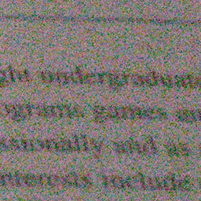

# Project Components

This project focuses on two major components:
1. **Video enhancement system and image processing.**
2. **Data extraction and analytics specific about vehicles and license plates.**


## 1. Video Enhancement System

### Image/Video Stabilization:

- **Image stabilization by classical calculations**:
    * **Options**: Directory of images input -> processing -> image result

- **Reticle image stabilization using optical flow and averaging**:
    * **Options**: 
        - Video input -> processing -> image result
          
        - Video input -> processing -> video result with averaging
          
        - Video input -> processing -> video result without averaging
          

### Video Enhancement:

1. **Averaging and stabilization - ECC** by choosing a segmentation map for an object that we want to stabilize.
    * **Options**: Directory of images + directory of segmentation mask -> processing -> image result
      

2. **De-noise** - [Repository](https://github.com/xinntao/Real-ESRGAN)
    * **Options**: Video + ROI User selection -> processing -> denoised video result
      
      

3. **De-blur** - [Repository](https://github.com/JingyunLiang/RVRT)
    * **Options**: Video + ROI User selection -> processing -> De-blure video result
      
      
      

4. **De-jpeg** - [Repository](https://github.com/ckkelvinchan/RealBasicVSR)
    * **Options**: Video + ROI User selection -> processing -> De-jpeg video result
      


### Video Processing 
1. **Blur kernel estimation** - [Repository](https://github.com/GuillermoCarbajal/NonUniformBlurKernelEstimation)
    * **Options**: Image + ROI User selection -> processing -> Kernel blur estimation
      

2. **Object segmentation based on text prompt** - [Repository](https://github.com/IDEA-Research/Grounded-Segment-Anything)
    * **Options**: Directory of images + text prompt -> processing -> segmentation map
      

3. **Object Detection & Tracking & REID - YOLO** - [Repository](https://github.com/mikel-brostrom/yolo_tracking)
    * **Options**: Video + classes and other terms -> processing -> crop and other stuff
      
      

4. **Optical Flow** - [Repository](https://github.com/facebookresearch/co-tracker)
    * **Options**: Video + ROI User selection -> processing -> Video & PT

5 **Frame Interpolation** - [Repository](https://github.com/google-research/frame-interpolation)
    * **Options**: Image a + image b -> processing -> crop and other stuff
      

6. **Questions and Answering** - Based on the [Lavis Model](https://github.com/salesforce/lavis) and [ViLT Model](https://huggingface.co/dandelin/vilt-b32-finetuned-vqa)
    * **Options**: 
      - Person file questions + image -> processing -> Answer
      - Car file questions + image -> processing -> Answer
      - Free text question + image -> processing -> Answer
        

7. **Create Motion Blur for Objects** - Based on optical flow and some logic. (Coming Soon)

8. **Remove/Inpaint Any Object**
    * **Options**: 
      - Video + ROI User selection -> processing (Model) -> Inpaint object inside video, [Repository](https://github.com/geekyutao/Inpaint-Anything)
        
      - Video + ROI User selection -> processing (Classic) -> Inpaint object inside video
        
        

9. **Segmentation based on Optical Flow** - Get segmentation (BB) based on the optical flow points track
    * **Options**: Video + ROI User selection -> processing -> cropped object, bb
      

### Video Compression:
1. **Video Compression**: Compress video via H264 using YOLO Detector
    

## 2. Data Extraction and Analytics

Specifically regarding vehicles and license plates. Follow the provided web page for results for cars and license plates according to your terms. The results are provided as a JSON file per object (Car and its license) with the best score.

#### Note -> to use this web page u should to buy and install the license for - [PlateRecognizerCompany](https://www.google.com/aclk?sa=l&ai=DChcSEwjx2_2bmuKAAxUY0XcKHZTHANAYABAAGgJlZg&gclid=CjwKCAjw5_GmBhBIEiwA5QSMxHvZG2VmGfzr7A3M9KEBDa1AsNjAU1Io8bo2zuvxvqACoi-ejk36oRoCKTwQAvD_BwE&sig=AOD64_3SFgcETFB0M1Dj-5PB3Za-oEFRKg&q&adurl&ved=2ahUKEwiY-vObmuKAAxX7_rsIHTGBBG8Q0Qx6BAgGEAE)


# Get Started

#### 1. Clone the Repository
```bash
git clone <repository_url>
```

#### 2. Install PyTorch
```bash
pip3 install torch torchvision torchaudio
```

#### 3. Setup the Project
Navigate to the project's root directory and run:
```bash
pip install -r requirements.txt
sudo apt install python3-tk
sudo apt install tk-dev
```

#### 4. Download and Install the .pt Files
```bash
python Install_pt_files.py
```

#### 5. Run the Main Script
```bash
python gui_video_processing_via_tkniret_3.py
```

#### 6. You should see the main window


## **Remember** #
##### The way to get into the system for the vehicle and license plate is by clicking the below link of the window
